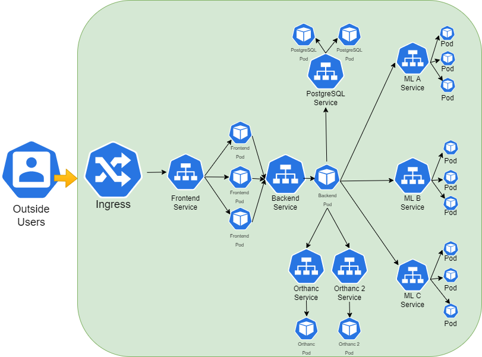

# Healthcare-App
App to help doctors to quickly analyse medical images and researchers to deploy ML models

##Installations
You need to install:

 **Docker** - https://docs.docker.com/get-docker/
 
**Minikube** - https://minikube.sigs.k8s.io/docs/start/

**Minikube ingress** - https://kubernetes.io/docs/tasks/access-application-cluster/ingress-minikube/

**Terraform** - https://www.terraform.io/downloads

After that, you need to change value of **keys** and **IDs** for the **social accounts** and the value for **email** and **password** to sending emails. You also need to put a value for **master_key** and **master_iv** variables on **"backend/Django/container_api/scripts/cifra.py"** file and on **"backend/Django/container_api/scripts/decifra.py"**.

Then, you have to open **7** command line windows:

In the first one, run the command **"minikube start"**, then go to the frontend root folder and run the commands **"yarn install"** and **"yarn build"**.

In the second one, go to the **"kubernetes/backend_database/database/terraform_database"** folder and run the commands **"terraform init"**, **"terraform plan"** and **"terraform apply"**.

In the third one, go to the **"kubernetes/orthanc/terraform_orthanc"** folder and run the commands **"terraform init"**, **"terraform plan"** and **"terraform apply"**.

In the fourth one, go to the **"kubernetes/orthanc/terraform_orthanc_2"** folder and run the commands **"terraform init"**, **"terraform plan"** and **"terraform apply"**.

In the fifth window, go to the **"kubernetes/backend_database/backend"** folder and run **"docker build backend:1 -f Dockerfile <path_to_backend_Django_root_folder>** and then go to **"kubernetes/backend_database/backend/terraform_backend"** folder and run the commands **"terraform init"**, **"terraform plan"** and **"terraform apply"**.

In the sixth window, go to the "kubernetes/frontend" folder and run **"docker build frontend:1 -f Dockerfile <path_to_frontend_root_folder>** and then go to **"kubernetes/frontend/terraform_frontend"** folder and run the commands **"terraform init"**, **"terraform plan"** and **"terraform apply"**.

In the seventh window, run the command **"minikube tunnel"**.

Then, you have to ssh into the backend pod to run **"python3 manage.py shell"** and apply these commands **"from django.contrib.auth.models import Group, Permission", "new_group, created = Group.objects.get_or_create(name='health_professionals')"** and **new_group, created = Group.objects.get_or_create(name='investigators')**. Then, leave the shell and execute the file **"admin_key_iv.py"** to add a key and a iv to the admin to encrypt his information in the database. Then exit the pod shell.

Now, you can close all windows **except the last one**.

Finally, you can open your favourite browser and write **localhost** to use the app.
